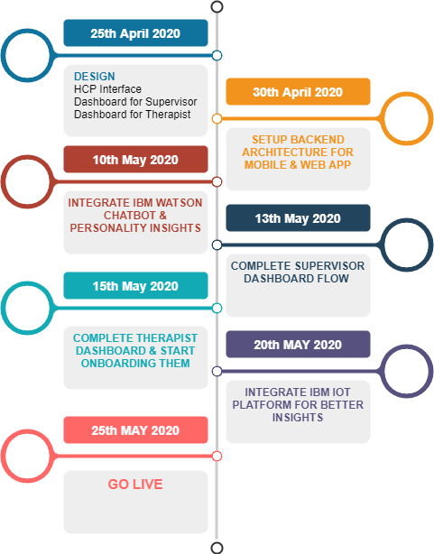

# Prudence
Finding the Path of Hope in Darkness

## Contents

1. Short description
2. Demo video
3. The architecture
4. Long description
5. Project roadmap
6. Design Mockups
7. Team Profile
8. Acknowledgments
9. Team

## Short Description
1-  Proactively Protect  Mental Health of Health Care Workers Using.

## Demo Video

 ## The Architecture

## Long Description

### The Problem
The COVID-19 pandemic has overwhelmed the healthcare systems across the globe. With no effective treatment in sight, and thousands of deaths every day has resulted in fear, panic and stress among healthcare workers. The fear of getting infected with COVID-19 hinders doctors, nurses and staff to provide the compassionate care they normally do. Even in the most developed countries of the world there is a shortage of PPE and doctors and nurses have to risk their lives to save lives. 

Doctors have to decide who to provide treatment and who are left on their own. Imagine how tough it is for them to make such decisions. While these health care workers are working tirelessly on the front lines we need to remember they too have families, friends and colleagues who they care about. We need to understand that seeing so much suffering day in day out results in severe mental health problems.

According to WHO almost everyone suffers from psychological stress when going through an emergency. When doctors/nurses/staff are stressed out there is  a higher chance of mistakes thereby compromising patient safety. So how do we tackle it? How do we protect the most heroic peoples of our community and provide them with means to vent out their frustration and help save lives?  How do we allow hospital organizations to manage their staffs’ stress levels to achieve optimal productivity?

### Our Solution

Team Prudence has developed a unique AI driven application that builds on top of IBM’s cutting edge AI services. It enables healthcare workers to monitor their mental health, suggests activities to release stress, allows them to  interact with an Artificially Intelligent chatbot to explain their situation and if need be get connected to a therapist to help them manage their situation. The assignment of a therapist can be done intelligently using AI as well. 

Furthermore we build on the data collected to generate summary reports of stress levels  to allow managers/supervisors to manage their teams proactively and solve their problems in real-time. Our solution can help leaders at different levels of hospitals to make data driven decisions to have a healthy working environment even in such a crisis situation.

#### How AI and IBM Cloud Make All This Possible
Our solution uses state of the art Natural Language Processing and Machine learning powered by IBM Watson. The chatbot engages with the healthcare worker serves as an empathetic listener where as Watson Personality Insights helps in understanding the personality of healthcare worker to effectively help in predicting and managing the mental health of healthcare practitioners. 

We also utilize IBM IOT platform to monitor their wellbeing as well and understand when they are at risk of burnout.  IBM IoT platform allows us to get data on the steps taken, sleep and heart rate  of the healthcare worker. This helps in generating a more comprehensive stress risk score of the user. We believe our solution can reduces stress, increase productivity, instill hope among healthcare  workers that there are better days ahead and allow leaders to manage their teams with compassion and effectiveness.

## DESIGN MOCKUPS

Health care worker application designs https://www.figma.com/proto/2RG3yznmdZNHw31zNqREjn/Covid_19--Prudence?node-id=56%3A765&viewport=503%2C578%2C0.22066399455070496&scaling=min-zoom

Supervisor application screens https://www.figma.com/proto/2RG3yznmdZNHw31zNqREjn/Covid_19-Prudence?node-id=188%3A472&scaling=scale-down

## PROJECT ROAD MAP

## Team

Muhammad Noman - AI and ML Product Specialist

Becky Ng - Frontline RN

Osama Shakir -  Front End Developer

Hamza Khan - Designer

Saad Ahmed -  Data Scientist
